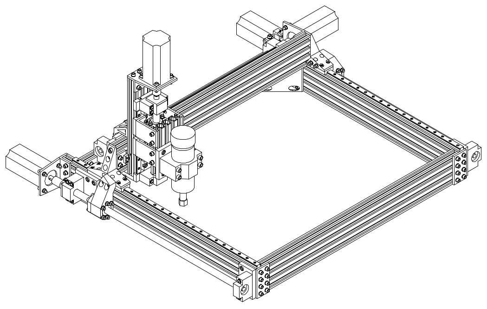
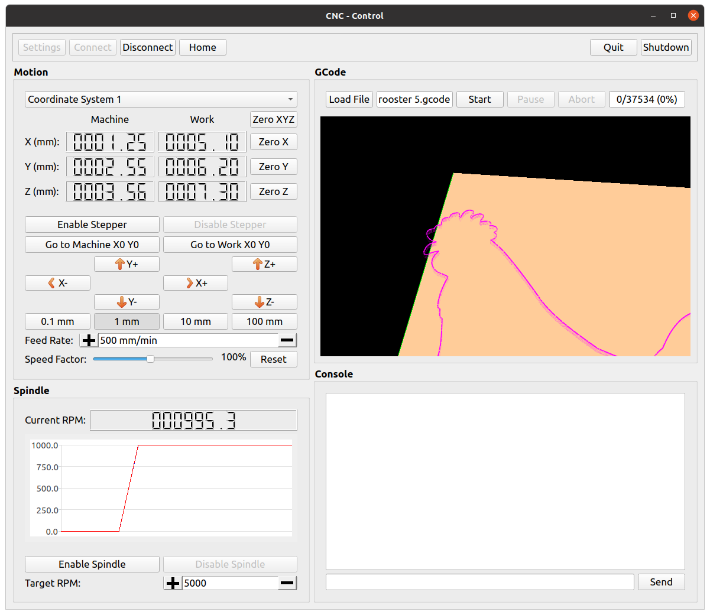

# CNC
This is a project to learn how to create a 3-axis CNC router. It contains the mechanical, electrical and software designs.

## Folder Descriptions

### CAD
This folder contains the CAD files to build the CNC. It is built from aluminium extrusions and 3D printed parts.

### control
This folder contains the graphical user interface for controlling the CNC from a computer.

### electronics/teensy
This folder contains the PCB design of the board controlling the stepper drivers, endstops, and spindle drive.

### firmware
This folder contains the firmware that parses the G-code to control the spindle speed and the stepper motors using a trapezoidal velocity profile.
